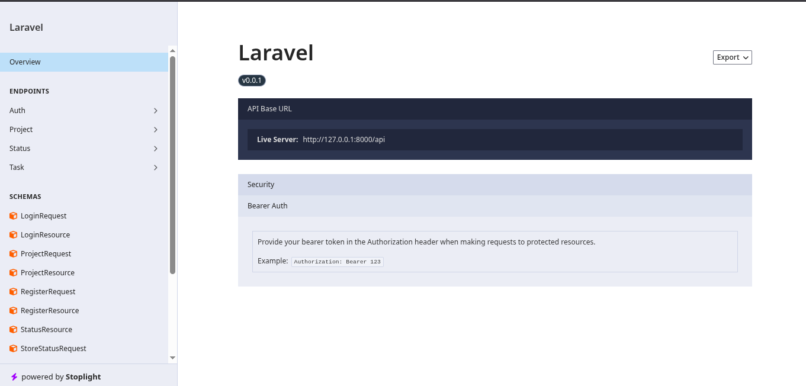

# Trello Clone - Backend API

API RESTful pour l'application Trello Clone construite avec **Laravel 12** et **Sanctum** pour l'authentification.

---

## 🚀 Fonctionnalités

### 🔐 Authentification
- **Inscription et connexion** des utilisateurs
- **Tokens d'authentification** avec Laravel Sanctum
- **Gestion des sessions** utilisateur
- **Protection CSRF** intégrée

### 📋 Gestion de Projets
- **CRUD complet** des projets
- **Attribution automatique** des statuts par défaut

### 📊 Statuts des Tâches
- **Statuts personnalisables** par projet
- **Couleurs personnalisées** pour chaque statut

### ✅ Gestion des Tâches
- **CRUD complet** des tâches
- **Drag & Drop** pour réorganiser les tâches entre statuts
- **Mise à jour en temps réel** des positions
- **Association** aux statuts et projets

### 📚 Documentation API
- **Scramble** pour la documentation automatique
- **Interface Swagger interactive** (`/docs/api`)
- **Tests d'API** intégrés

---

## 🛠️ Stack Technique

| Technologie | Version | Description |
|-------------|--------|-------------|
| **PHP** | 8.2+ | Langage backend |
| **Laravel** | 12.0 | Framework PHP |
| **Laravel Sanctum** | 4.0 | Authentification API |
| **MySQL/PostgreSQL** | - | Base de données |
| **Scramble** | - | Documentation API |
| **PHPUnit** | 11.5+ | Tests unitaires |
| **CORS** | - | Partage entre domaines |

---

## 📋 Prérequis

### Système
- **PHP 8.2** ou supérieur
- **Composer** (dernière version)
- **MySQL 8.0+** ou **PostgreSQL 12+**
- **Git** pour le versioning

### Extensions PHP requises
```bash
# Extensions essentielles
php -m | grep -E "(pdo|openssl|mbstring|tokenizer|xml|ctype|fileinfo|json|bcmath|filter)"

# Recommandées
php -m | grep -E "(curl|gd|imagick|zip|sqlite)"
```

---

## 🚀 Installation

### 1. Cloner le projet
```bash
git clone https://github.com/trello-clone-fullstack/trello-api-laravel
```

### 2. Installation automatique
```bash
# Installation complète avec une seule commande
composer run setup
```
Cette commande exécute :
- `composer install` (dépendances)
- Configuration du fichier `.env`
- Génération de la clé application
- Migration de la base de données
- Installation des dépendances frontend
- Build des assets

### 3. Configuration manuelle
```bash
# Installer les dépendances
composer install

# Configurer l'environnement
cp .env.example .env
php artisan key:generate

# Configurer la base de données dans .env
DB_CONNECTION=mysql
DB_HOST=127.0.0.1
DB_PORT=3306
DB_DATABASE=trello_clone
DB_USERNAME=votre_user
DB_PASSWORD=votre_password

# Exécuter les migrations
php artisan migrate --force

# Lancer le serveur de développement
php artisan serve --host=0.0.0.0 --port=8000
```

---

## 🔧 Configuration

### Variables d'environnement principales
```env
# Application
APP_NAME="Trello Clone API"
APP_ENV=local
APP_KEY=base64:generated_key_here
APP_DEBUG=true
APP_URL=http://localhost:8000

# Base de données
DB_CONNECTION=mysql
DB_HOST=127.0.0.1
DB_PORT=3306
DB_DATABASE=trello_clone
DB_USERNAME=root
DB_PASSWORD=password

# Sanctum (Authentification)
SANCTUM_STATEFUL_DOMAINS=localhost:8000
SANCTUM_STATEFUL_COOKIES=true

# Cache
CACHE_DRIVER=file
CACHE_PREFIX=trello_clone_

# Queue
QUEUE_CONNECTION=database
```

---


## 📚 Routes API

### Authentification
| Méthode | Route | Description |
|----------|-------|-------------|
| `POST` | `/api/register` | Inscription utilisateur |
| `POST` | `/api/login` | Connexion utilisateur |
| `POST` | `/api/logout` | Déconnexion (authentifié) |
| `GET` | `/api/user` | Infos utilisateur connecté |

### Projets
| Méthode | Route | Description |
|----------|-------|-------------|
| `GET` | `/api/projects` | Lister tous les projets |
| `POST` | `/api/projects` | Créer un nouveau projet |
| `GET` | `/api/projects/{id}` | Détails d'un projet |
| `PUT` | `/api/projects/{id}` | Mettre à jour un projet |
| `DELETE` | `/api/projects/{id}` | Supprimer un projet |

### Statuts
| Méthode | Route | Description |
|----------|-------|-------------|
| `GET` | `/api/statuses` | Lister tous les statuts |
| `POST` | `/api/statuses` | Créer un statut |
| `GET` | `/api/statuses/{id}` | Détails d'un statut |
| `PUT` | `/api/statuses/{id}` | Mettre à jour un statut |
| `DELETE` | `/api/statuses/{id}` | Supprimer un statut |

### Tâches
| Méthode | Route | Description |
|----------|-------|-------------|
| `GET` | `/api/tasks` | Lister toutes les tâches |
| `POST` | `/api/tasks` | Créer une nouvelle tâche |
| `GET` | `/api/tasks/{id}` | Détails d'une tâche |
| `PUT` | `/api/tasks/{id}` | Mettre à jour une tâche |
| `DELETE` | `/api/tasks/{id}` | Supprimer une tâche |
| `PUT` | `/api/tasks/{id}/position` | Mettre à jour la position |

---

## 📖 Documentation API

### Accès
Une fois le serveur démarré, accédez à :
- **Documentation interactive** : `http://localhost:8000/docs/api`
- **OpenAPI JSON** : `http://localhost:8000/docs/api.json`

### Aperçu de la documentation



La documentation Scramble fournit :
- **Interface interactive** pour tester les endpoints
- **Descriptions détaillées** de chaque route
- **Exemples de requêtes/réponses**
- **Schémas de données** automatiques

### Exemples d'utilisation

#### Authentification
```bash
# Inscription
curl -X POST http://localhost:8000/api/register \
  -H "Content-Type: application/json" \
  -d '{
    "name": "John Doe",
    "email": "john@example.com",
    "password": "password123"
  }'

# Connexion
curl -X POST http://localhost:8000/api/login \
  -H "Content-Type: application/json" \
  -d '{
    "email": "john@example.com",
    "password": "password123"
  }'
```

#### Projets
```bash
# Créer un projet
curl -X POST http://localhost:8000/api/projects \
  -H "Authorization: Bearer votre_token" \
  -H "Content-Type: application/json" \
  -d '{
    "project_name": "Mon projet",
    "description": "Description du projet"
  }'

# Lister les projets
curl -X GET http://localhost:8000/api/projects \
  -H "Authorization: Bearer votre_token"
```

---

## 🧪 Scripts Disponibles

### Développement
```bash
# Démarrer tous les services (serveur, queue, logs, watcher)
composer run dev

# Serveur Laravel uniquement
php artisan serve --host=0.0.0.0 --port=8000

# Worker de queue
php artisan queue:work --tries=3

# Logs en temps réel
php artisan pail --timeout=0
```


### Build & Optimisation
```bash
# Optimiser pour la production
composer run build

# Mettre en cache
php artisan optimize:clear
php artisan config:cache
php artisan route:cache
php artisan view:cache

# Nettoyer les caches
php artisan cache:clear
```

---


---

## 🔒 Sécurité

### Laravel Sanctum
- **Tokens** sécurisés avec expiration configurable
- **Gestion des permissions** par token
- **Protection CSRF** automatique

### Bonnes pratiques implémentées
- **Validation** des entrées utilisateur
- **Sanitization** des données
- **Hashage** des mots de passe
- **CORS** configuré pour le frontend
- **HTTPS** recommandé en production


---

## 📊 Base de Données

### Diagramme de la base de données
Visualisez la structure complète de notre base de données :
👉 **[Voir le diagramme sur dbdiagram](https://dbdiagram.io/d/Trello_Clone_DB-69afd4a177d079431b472906)**

### Structure principale
```sql
users          # Utilisateurs et authentification
projects       # Projets créés par les utilisateurs
statuses       # Statuts personnalisés des tâches
tasks          # Tâches associées aux projets
```

### Relations Eloquent
```php
// User
public function projects() {
    return $this->hasMany(Project::class);
}

// Project  
public function user() {
    return $this->belongsTo(User::class);
}

public function statuses() {
    return $this->hasMany(Status::class);
}

public function tasks() {
    return $this->hasMany(Task::class);
}

// Status
public function project() {
    return $this->belongsTo(Project::class);
}

public function tasks() {
    return $this->hasMany(Task::class);
}

// Task
public function project() {
    return $this->belongsTo(Project::class);
}

public function status() {
    return $this->belongsTo(Status::class);
}
```

### Migrations principales
```php
// create_users_table
Schema::create('users', function (Blueprint $table) {
    $table->id();
    $table->string('name');
    $table->string('email')->unique();
    $table->timestamp('email_verified_at')->nullable();
    $table->string('password');
    $table->rememberToken();
    $table->timestamps();
});

// create_projects_table
Schema::create('projects', function (Blueprint $table) {
    $table->id();
    $table->foreignId('user_id')->constrained();
    $table->string('project_name');
    $table->text('description')->nullable();
    $table->timestamps();
});

// create_statuses_table
Schema::create('statuses', function (Blueprint $table) {
    $table->id();
    $table->foreignId('project_id')->constrained();
    $table->string('status_name');
    $table->string('color')->default('#6B7280');
    $table->integer('position')->default(0);
    $table->timestamps();
});

// create_tasks_table
Schema::create('tasks', function (Blueprint $table) {
    $table->id();
    $table->foreignId('project_id')->constrained();
    $table->foreignId('status_id')->constrained();
    $table->string('task_name');
    $table->text('description')->nullable();
    $table->integer('position')->default(0);
    $table->timestamps();
});
```

---

## 🚀 Déploiement

### Production
```bash
# Installation dépendances production
composer install --optimize-autoloader --no-dev

# Optimisation application
php artisan config:cache
php artisan route:cache
php artisan view:cache
php artisan optimize

# Migration base de données
php artisan migrate --force

# Build assets
npm run build
```


## 📞 Support

### Obtenir de l'aide
- **Documentation Laravel** : [laravel.com/docs](https://laravel.com/docs)
- **Communauté** : [laracasts.com](https://laracasts.com)
- **Forum** : [laravel.io](https://laravel.io)

### Signaler un problème
- **Issues GitHub** : Ouvrir une issue sur le dépôt
- **Bug Report** : Envoyer un email détaillé
- **Sécurité** : `security@laravel.com`

---

## 📄 Licence

Ce projet est sous licence **MIT License**.

---

## 🔗 Technologies Utilisées

### Backend
- **[Laravel 12](https://laravel.com)** - Framework PHP
- **[Sanctum](https://laravel.com/docs/sanctum)** - Authentification API
- **[MySQL](https://www.mysql.com/)** - Base de données
- **[Scramble](https://scramble.dedoc.co/)** - Documentation API

### Outils
- **[Composer](https://getcomposer.org/)** - Gestion dépendances
- **[Docker](https://www.docker.com/)** - Conteneurisation
- **[Git](https://git-scm.com/)** - Versioning

---

**Développé avec ❤️ et Laravel 12**
